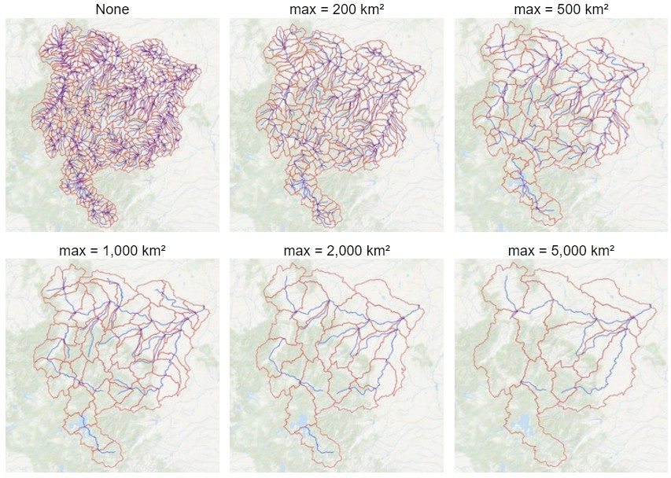

# Upstream Delineator

A set of Python scripts for delineating watersheds or drainage basins
using data from [MERIT-Hydro](https://doi.org/10.1029/2019WR024873) and 
[MERIT-Basins](https://doi.org/10.1029/2019WR025287). 
The script outputs subbasins and a river network graph representation, 
which can be useful for watershed modeling or machine learning applications. These
are also sometimes referred to as "Hydrologic Response Units" or HRUs.

This script also lets you subdivide the watershed at specific locations if you provide
additional points that fall inside the main watershed, as shown in red in the image below.


These scripts were modified from [delineator.py](https://github.com/mheberger/delineator). 


# Outputs:

Geodata in a variety of formats -- shapefile, geopackage, GeoJSON, etc., for:

   * sub-basin polygons 
   * sub-basin outlet points 
   * river reaches 

Optionally:

   * A network graph representation of the river network.

The network graph can be saved in a variety of formats -- Python NetworkX Graph object (in a pickle file),
JSON, GML, XML, etc.

You can also customize the size of the subbasins; see *Outputing larger subbasins* below. 


# Using these scripts

This repository includes sample data covering Iceland. To delineate watersheds in other 
locations, you will need to download datasets from MERIT-Hydro and MERIT-Basins. 
Instructions on how to get the data and run the script are provided below.

To get started, download the latest release from this GitHub repository. If you're a 
GitHub user, you can fork the repository.

These scripts were developed and tested with Python version 3.12.

I recommend creating a Python virtual environment in which to run the script.
Here is a good [introduction to virtual environments]
(https://python.land/virtual-environments/virtualenv) -- 
why they are useful, and how to use them. You can create and activate the 
virtual environment, then install all the required packages with the following commands. 

Open the Terminal (Linux and Mac) or Command Prompt (Windows), `cd` 
to the directory containing `delineator.py` and related files, then enter these commands.

To create the virtual environment:
```
python -m venv venv
```

To activate the virtual environment:

```
# Windows Command Prompt or PowerShell
venv\Scripts\activate.bat

# Windows PowerShell
venv\Scripts\Activate.ps1

#Linux and MacOS venv activation
$ source venv/bin/activate
```

Next, install required packages:
```
$ pip install -r requirements.txt
```
This script uses the latest versions of Python packages circa November 2023, 


# Overview of using `subbasins.py`

The major steps are the following, with more detailed instructions below.

1. [Download basin-scale MERIT-Hydro raster data (mghydro.com)](#step1)
2. [Download MERIT-Basins vector data (reachhydro.com)](#step2)
3. [Create a CSV file with your desired watershed outlet points](#step4)
4. [Edit settings in `subbasins_config.py`](#step5)
5. [Run `subbasins.py` to delineate watersheds](#step6)
6. [Review output](#step7)
7. [Run again to fix mistakes (repeat steps 4 – 7)](#step8)

Before you begin downloading data in steps 1 and 2, determine which files you need based on your region of interest. 
The data files are organized into continental-scale river basins, or Pfafstetter Level 2 basins. 
There are 61 of these basins in total. Basins are identified by a 2-digit code, with values from 11 to 91. 


# Detailed Instructions

## <a name="step1">1. Download MERIT-Hydro raster data</a>

You will need two sets of MERIT-Hydro gridded (or raster) data: **flow accumulation**
and **flow direction**. 
The authors of the MERIT-Hydro created 5-degree tiles, but this script needs seamless 
layers that cover entire river basins. You can freely download these data here:
[https://mghydro.com/watersheds/rasters](https://mghydro.com/watersheds/rasters)

You will need to update `subbasins_config.py` to tell the script where to find these data files. 
Modify these variables:

- `MERIT_FDIR_DIR` (for flow direction)
- `MERIT_ACCUM_DIR` (for flow accumulation)


## 2. <a name="step2">Download MERIT-Basins vector data</a>

Download the shapefiles for unit catchments and river reaches. Follow the instructions here:
[https://www.reachhydro.org/home/params/merit-basins](https://www.reachhydro.org/home/params/merit-basins)

In the folder `pfaf_level_02` , download two sets of files:

1. unit catchment shapefiles: `cat_pfaf_##_MERIT_Hydro_v07_Basins_v01.shp`
2. river flowline shapefiles: `riv_pfaf_##_MERIT_Hydro_v07_Basins_v01.shp`

In these files, `##` is the Pfafstetter Level 2 basin code. 
See the figure above to determine which of the 61 level 2 basins you need, 
depending on your region of interest. 

Unzip these files and save them to a folder on your hard drive. 
Then, in `subbasins_config.py`, update the variables 
`CATCHMENTS_DIR` and `RIVERS_DIR` to tell the script where to find these data.

## <a name="step4">3. Create a CSV file with your desired watershed outlet points</a>

The script reads information about your desired watershed outlet points from a 
plain-text comma-delimited (CSV) file. Edit this file carefully, as the script will 
not run if this file is not formatted correctly. 

The CSV file **must** contain three required fields or columns.

- **id** - _required_: a unique identifier for your watershed or outlet point,
an alphanumeric string. May be any length, but shorter is better. 
The script uses the id as the filename for output, so avoid using any 
forbidden characters. On Linux, do not use the forward slash /. 
On Windows, the list of forbidden characters is slightly longer (`\< \> : " / \ | ? \*`).

- **lat** - _required_: latitude in decimal degrees of the watershed outlet.
Avoid using a whole number without a decimal in the first row. 
For example, use 23.0 instead of 23.

- **lng** - _required_: longitude in decimal degrees

All latitude and longitude coordinates should be in decimal degrees 
(EPSG: 4326, [https://spatialreference.org/ref/epsg/wgs-84/](https://spatialreference.org/ref/epsg/wgs-84/)).


- The first row in the CSV file will be the main basin outlet.

- All the following points should all be contained in the first point's watershed.

Each point should fall into a different MERIT-Basins unit catchment. 
This means that the you should not input points that are too closely spaced along a river.
You can view MERIT-Basin catchments in GIS, or on the Global Watersheds web app: 
[https://mghydro.com/watersheds](https://mghydro.com/watersheds). On the map, at the top right, there is
a basemap selector widget -- check the box to activate 'MERIT-Basins unit catchments.' Zoom in to at least
zoom level 8 in order to enable this option. 

## <a name="step5">4. Update `subbasins_config.py`</a>

Read through the options and set the variables as you wish. 
It is important to input the correct folder paths to where you are storing 
the input data on your computer.

## <a name="step6">5. Run `subbasins.py` to delineate watersheds</a>

Once you have downloaded the datasets listed above, and updated `subbasins_config.py`, 
you are ready to delineate watersheds. The script takes exactly two arguments:

`input_csv` - Input CSV filename, for example 'gages.csv'

`output_prefix` - Output prefix, a string. The output files will start with this string. For example, 
if you provide 'shasta', the script will produce `shasta_subbasins.shp`, `shasta_outlets.shp`, etc.

Run the script from the command line like this:
```
$ python subbsins.py outlets.csv testrun
```

This assumes you have put `outlets.csv` in the same folder with the scripts, 
which is not always convenient. You can provide a full file path as follows 
(examples for Windows and Linux):
```
$ python subbasins.py C:\Users\matt\Desktop\outlets.csv test
$ python subbasins.py /home/files/outlets.csv test
```

Alternatively, you can call the delineation routine from Python, in a script
or via the console:

```
>> from subbasins import delineate
>> delineate('outlets.csv', 'testrun')
```

## <a name="step7">6. Review results</a>

The script can output several different geodata formats, 
as long as the format is supported by `GeoPandas`. Shapefiles are popular, 
but I recommend **GeoPackage**, as it is a more modern and open format. 
**Feather** is another lightweight, portable data format.
To get a full list of available formats, follow the directions 
[here](https://geopandas.org/en/stable/docs/user_guide/io.html#writing-spatial-data)
(see Supported Drivers).


## <a name="step8">7. Run again to fix any mistakes</a>

Automated watershed delineation is often incorrect. 
The good news is that errors can often be fixed by slightly moving the 
location of your watershed outlets.

Repeat steps 3 to 6 to create a new outlets CSV file, or modifying your existing file, 
using revised coordinates. The script will automatically overwrite existing files
without any warning, so first make sure to back up anything you want to save.

## Pickle Files

**Optional.** One of the slow steps in the script is reading shapefiles and creating a GeoDataFrame. 
Once you have done this once, you can save time in the future by storing the GeoDataFrame as a .pkl file.
Enter a file path for the constant `PICKLE_DIR`, and the script will automatically save files here. 
The script will not search for pickle files if you leave this as a blank string, `''` 
Note that these files are not any smaller than the original shapefile, so they don't save disk space;
they are just faster to load. 


## Simplification

The Python routine I am using to simplify the subbasin polygons (`topojson`) is not perfect.
Sometimes, the output will contain weird overlaps and slivers. If appearances matter, 
I recommend using external software for simplification.
*Mapshaper* works well, either online, or you can insatll it an run it from the command line. 
Note that it can only accept shapefiles or geojson, and not geopackages. 
Also, GIS software like QGIS (free) or ArcGIS (commercial) do the job nicely. 


## Outputing larger subbasins

The unit catchments in MERIT-Basins have an average size of around 40 km². If you wish to create
larger subbasins, in `subbasins_config.py`, set the variable `CONSOLIDATE = True`.
Then, set a value for `MAX_AREA` in km². This sets the upper limit on the size of a subbasin.
The script will merge unit catchments such that the overall structure
and connectivity of the drainage network is maintained. This example shows the subbasins
for the Yellowstone River with different values of `MAX_AREA`. 



By "rediscretizing" the subbasins, you can reduce their number while increasing their size. 
This can mean less processing time for hydrologic models. 

It also appears to 
make the subbasin sizes somewhat more homogeneous. After consolidation, the distribution
of subbasin areas tends to become more tightly clustered around the mean, 
as indicated by a lower coefficient
of variation (standard deviation divided by the mean). Here are the results of a
little experiment in using different values of `MAX_AREA` for the Yellowstone
basin. Statistics are for the subbasin areas in km². 


| MAX_AREA | count |  median | mean  | std. dev. |  CV   | skewness |
|----------|-------|---------|-------|-----------|-------|----------|
|     None |  687  |    37   |   45  |     36    |  0.80 |    1.60  |
|      200 |  239  |   140   |  128  |     53    |  0.41 |   -1.61  |
|      500 |   97  |   344   |  315  |    132    |  0.42 |   -0.52  |
|    1,000 |   52  |   641   |  588  |    281    |  0.48 |   -0.39  |
|    2,000 |   24  | 1,370   | 1,270 |    490    |  0.39 |   -1.03  |
|    5,000 |   14  | 2,100   | 2,180 |  1,310    |  0.60 |    0.09  |


## Limitations

The code mostly assumes that the user's inputs make sense, and I have not 
created extensive error handling for bad inputs, or code to handle all the possible edge cases. 
For example, the MERIT-Basins dataset
has some gaps and slivers of missing data; if your outlet points falls 
into one of these locations, it may cause problems. 

*Rivers* - The output river polylines are largely for display and may not 
be fully connected. I suspect this has to do with the process of merging neighboring
polylines, which can create multipart features with topology problems like dangles
and disconnects. I'm still working on this problem and I'm not sure if there is an easy fix.
If appearances are important, you can use data from MERIT-Basins or elsewhere
to display the river network in your mapping software. 


# Contributing

For comments or questions, please contact the author: Matthew Heberger, matt@mghydro.com.

To report any bugs, you can create an Issue on this GitHub page.

This code is open source, so if you are motivated to make any 
modifications, additions, or bug fixes, you can fork the repository 
and then do a pull request on GitHub. 


# Acknowledgments
Code developed with support from [Upstream Tech](https://www.upstream.tech/).

