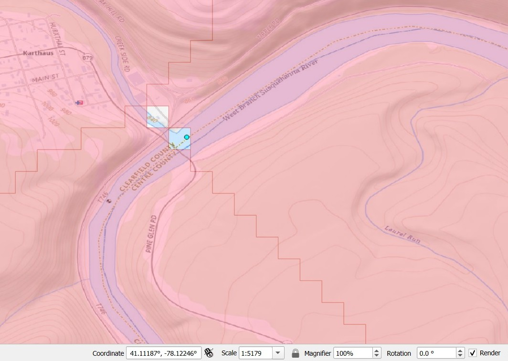

# Upstream Delineator

A set of Python scripts for delineating watersheds or drainage basins
using data from [MERIT-Hydro](https://doi.org/10.1029/2019WR024873) and 
[MERIT-Basins](https://doi.org/10.1029/2019WR025287). 
The script outputs geospatial data for subbasins and river reaches, 
and creates a river network graph representation, 
which can be useful for watershed modeling or machine learning applications. 

This script also lets you subdivide the watershed at specific locations, such as gages, if you provide
additional points that fall inside the main watershed, as shown in red in the image below.


These scripts are a heavily modified fork of [delineator.py](https://github.com/mheberger/delineator). 


# Outputs:

Geodata in a variety of formats -- shapefile, geopackage, GeoJSON, etc., for:

   * sub-basin polygons 
   * sub-basin outlet points 
   * river reaches 

and, optionally:

   * A network graph representation of the river network.

The network graph can be saved in a variety of formats -- Python NetworkX Graph object (in a pickle file),
JSON, GML, XML, etc.

You can also customize the size of the subbasins to make them larger; see *Outputing larger subbasins* below. 


# Using these scripts

This repository includes sample data covering Iceland. To delineate watersheds in other 
parts of the world, you will need to download datasets from MERIT-Hydro and MERIT-Basins. 
Instructions on how to get the data and run the script are provided below.

To get started, download the latest release from this GitHub repository (or fork the repository).

These scripts were developed and tested with Python version 3.11 and 3.12.

We recommend creating a Python virtual environment in which to run the script.
Here is a good
[introduction to virtual environments](https://python.land/virtual-environments/virtualenv)
-- why they are useful, and how to use them. You can create and activate the virtual
environment, then install all the required packages with the following commands. 

Open the Terminal (Linux and Mac) or Command Prompt (Windows), `cd` 
into the cloned repo.

To create the virtual environment:
```
python3 -m venv venv
```

To activate the virtual environment (on Windows you may need to allow scripts using -- search for `Set-ExecutionPolicy`). 

```
# Windows Command Prompt or PowerShell
venv\Scripts\activate.bat

# Windows PowerShell
venv\Scripts\Activate.ps1

#Linux and MacOS venv activation
$ source venv/bin/activate
```

Next, install required packages:
```
$ pip install .
```
This script uses the latest versions of Python packages circa April 2024.

Make sure that you have the correct version of numpy. The `pysheds v0.4` library
is *not* compatible with numpy v2.0. 


# Overview of using `subbasins.py`

The major steps are the following, with more detailed instructions below.
To simply try the program with the sample data provided, you can skip to step 5. 
When you are ready to try with your own locations, you will need to download additional 
data as described in steps 1 and 2.

1. [Export env vars pointing to raster and vector data](#step_env)
1. [Create a CSV file with your desired watershed outlet points](#step_csv)
1. [Override config defaults](#step_config)
1. [Delineate watersheds](#step_run)
1. [Review output](#step_review)
1. [Run again to fix mistakes](#step_repeat)

Before you begin downloading the data in steps 1 and 2, determine which files you need based on your region of interest. 
The data files are organized into continental-scale river basins, or Pfafstetter Level 2 basins. 
There are 61 of these basins in total. Basins are identified by a 2-digit code, with values from 11 to 91. 


MERIT Level 2 megabasins

# Detailed Instructions

## <a name="step_env">Export env vars pointing to raster and vector data</a>

You will need two set environment variables pointing to local or remote files containing global
[MERIT-Hydro](https://www.reachhydro.org/home/params/merit-basins) raster and vector data.

- `CATCHMENT_PATH` (for MERIT catchments)
- `RIVER_PATH` (for MERIT flowlines)
- `FLOW_DIR_PATH` (for MERIT flow direction)
- `ACCUM_PATH` (for MERIT flow accumulation)
- `MEGABASINS_PATH` (for MERIT Level 2 megabasins)

``` bash
export CATCHMENT_PATH="https://example.com/global_catchments.fgb"
export RIVER_PATH="https://example.com/global_flowlines.fgb"
export FLOW_DIR_PATH="https://example.com/merit_flowdir.tif"
export ACCUM_PATH="https://example.com//merit_accum.tif"
export MEGABASINS_PATH="https://example.com/file.shp"
```


## <a name="step_csv">Create a CSV file with your desired watershed outlet points</a>

The script reads information about your desired watershed outlet points from a 
plain-text comma-delimited (CSV) file. Edit this file carefully, as the script will 
not run if this file is not formatted correctly. 

The CSV file **must** contain these 4 required fields or columns.

- **id** - _required_: a unique identifier for your watershed or outlet point,
an alphanumeric string. The id may be any length, but shorter is better. 
The script uses the id as the filename for output, so avoid using any 
forbidden characters. On Linux, do not use the forward slash /. 
On Windows, the list of forbidden characters is slightly longer (`\< \> : " / \ | ? \*`).
Also, do not use id = 0, since the convention is that 0 is reserved for discharging to
the ocean.

- **lat** - _required_: latitude in decimal degrees of the watershed outlet.
Avoid using a whole number without a decimal in the first row. 
For example, use 23.0 instead of 23.

- **lng** - _required_: longitude in decimal degrees

- **is_outlet**: If the gage is a watershed outlet, enter `true` or `True` 
(capitalization does not matter). For intermediate
  upstream points that will be sub-basin outlets, enter `false` or `False`.

All latitude and longitude coordinates should be in decimal degrees 
(EPSG: 4326, [https://spatialreference.org/ref/epsg/4326/](https://spatialreference.org/ref/epsg/4326/)).

- The order of the columns does not matter, but the names must be exactly as shown above.

- If you are delineating more than one main watershed, put any subbasin 
 outlets immediately after the main outlet, as in the following example:

| id             | lat       | lng       | name                           | is_outlet |
|----------------|-----------|-----------|--------------------------------|-----------|
| foz-tua        | 41.217954 | -7.423504 | "Foz Tua, Portugal"            | true      |
| barragem-torga | 41.720    | -7.113    | "Barragem de Torga"            | false     |
| cm-1185        | 41.359    | -7.402    | "CM 1185 Crossing near Martim" | false     |
| baixo-sabor    | 41.22864  | -7.0124   | "Baixo Sabor, Portugal"        | true      |
| algoso         | 41.455    | -6.591    | "EN 219 Crossing near Algoso"  | false     |

In this example, there are two *main* outlets. The first, "foz-tua," has two subbasin
outlets. The second, "baixo-sabor," has one subbasin outlet. 

## <a name="step_config">Override config defaults</a>

Read through the options in `config.py`, then override any variables as you wish. 

``` python
graph, subbasins_gdf, rivers_gdf = delineate(
    csv_filename, output_prefix, {"WRITE_OUTPUT": True, "NETWORK_DIAGRAMS": True}
)
```

## <a name="step_run">Delineate watersheds</a>

Delineation can be run from the command line, or from Python. Either way, you will need to specify a few arguments:

- `input_csv` (required) - Input CSV filename, for example `outlets.csv`
- `output_prefix` (required) - Output prefix, a string. The output files will start with this string. For 
example, 
if you provide 'shasta', the script will produce `shasta_subbasins.shp`, `shasta_outlets.shp`, etc.
- `config_overrides` (optional, Python-only) - A dictionary of overrides. Eg to turn `VERBOSE` logging on or off.

You can run the script from the command line like this:

``` bash
python upstream_delineator/scripts/subbasins.py /path/to/file/outlets.csv shasta
```

Alternatively, you can call the delineation routine from Python:

``` python
>> from upstream_delineator.delineator_utils.delineate import delineate
>> delineate('/path/to/file/outlets.csv', 'shasta')
```

## <a name="step_review">Review results</a>

The script can output several different geodata formats, 
as long as the format is supported by `GeoPandas`. Shapefiles are popular, 
but we recommend **GeoPackage**, as it is a more modern and open format. 
**Feather** is another lightweight, portable data format.
To get a full list of available formats, follow the directions 
[here](https://geopandas.org/en/stable/docs/user_guide/io.html#writing-spatial-data)
(see Supported Drivers).


## <a name="step_repeat">Run again to fix any mistakes</a>

Automated watershed delineation is often incorrect. 
The good news is that errors can often be fixed by slightly moving the 
location of your watershed outlets.

Repeat the above steps to create a new outlets CSV file, or modify your existing file, 
using revised coordinates. The script will automatically overwrite existing files
without any warning, so first make sure to back up anything you want to save.


# Pickle Files

**Optional.** One of the slow steps in the script is reading shapefiles and creating a GeoDataFrame. 
Once you have done this once, you can save time in the future by storing the GeoDataFrame as a .pkl file.
Override the file path for the constant `PICKLE_DIR`, and the script will automatically save files here. 
The script will not search for pickle files if you leave this as a blank string, `''` 
Note that these files are not any smaller than the original shapefile, so they don't save disk space;
they are just faster to load. 


# Simplification

The Python routine used to simplify the subbasin polygons (`topojson`) is not perfect.
Sometimes, the output will contain weird overlaps and slivers. If appearances matter, 
we recommend setting `SIMPLIFY` to `False` and using external software for simplification.

*Mapshaper* works well. You can use the [web version](https://mapshaper.org/), or you can install and run it from the command line. 
Note that mapshaper will only accept shapefiles or geojson as input, and not geopackages or feather files. 

As an alternative, GIS software like QGIS (free) or ArcGIS (commercial) do the job nicely. 


# Outputting larger subbasins

The unit catchments in MERIT-Basins have an average size of around 40 km². If you wish to create
larger subbasins, se `CONSOLIDATE` to `True`.
Then, set a value for `MAX_AREA` in km². This sets the upper limit on the size of subbasins.
The script will merge unit catchments such that the overall structure
and connectivity of the drainage network is maintained. This example shows the subbasins
for the Yellowstone River with different values of `MAX_AREA`. 


By "rediscretizing" the subbasins with this option, you can reduce their number while increasing their size. 
This means that your hydrologic model will be smaller and simpler and probably run faster! 😊

The simplification routine also appears to 
make the subbasin sizes somewhat more homogeneous. The area of MERIT-Basins unit catchments
is highly variable, and highly skewed, with many very small unit catchments.
 After consolidation, the distribution
of subbasin areas tends to be more tightly clustered around the mean, 
as indicated by a lower coefficient
of variation (standard deviation divided by the mean). Here are the results of a
little experiment in using different values of `MAX_AREA` for the Yellowstone River
basin in North America. Statistics are for the subbasin areas in km². 


| MAX_AREA | count |  median | mean  | std. dev. |  CV   | skewness |
|----------|-------|---------|-------|-----------|-------|----------|
|     None |  687  |    37   |   45  |     36    |  0.80 |    1.60  |
|      200 |  239  |   140   |  128  |     53    |  0.41 |   -1.61  |
|      500 |   97  |   344   |  315  |    132    |  0.42 |   -0.52  |
|    1,000 |   52  |   641   |  588  |    281    |  0.48 |   -0.39  |
|    2,000 |   24  | 1,370   | 1,270 |    490    |  0.39 |   -1.03  |
|    5,000 |   14  | 2,100   | 2,180 |  1,310    |  0.60 |    0.09  |


# Limitations

More error handling of stress cases is forthcoming.
For example, the MERIT-Basins dataset
has some gaps and slivers of missing data; if your outlet points falls 
into one of these locations, it may cause problems. In this case, simply nudge the 
location by changing the latitude and/or longitude slightly. 

As another example, if you put two points in your input file that are the same, or very close
to one another, the script will fail and the error messages will not be very helpful. Please
make sure all of your points have a little space between them!




# Contributing

To report any bugs, you can create an Issue on this GitHub page.

This code is open source, so if you are motivated to make any 
modifications, additions, or bug fixes, you can make a pull request on GitHub. 


# Acknowledgments 

Thanks to Matthew Heberger who wrote the [original code](https://github.com/mheberger/delineator) built upon here.